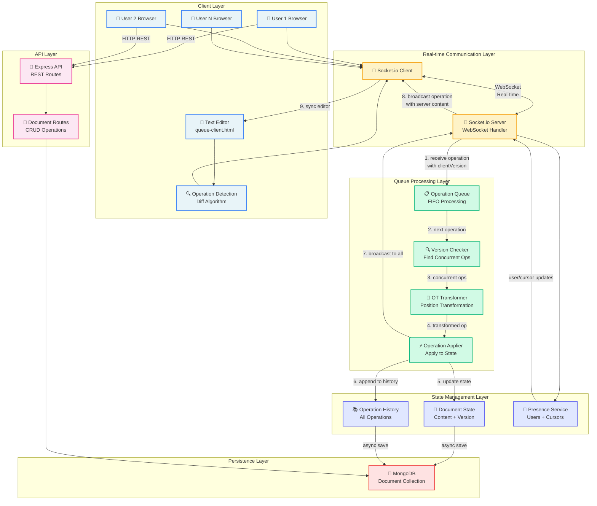
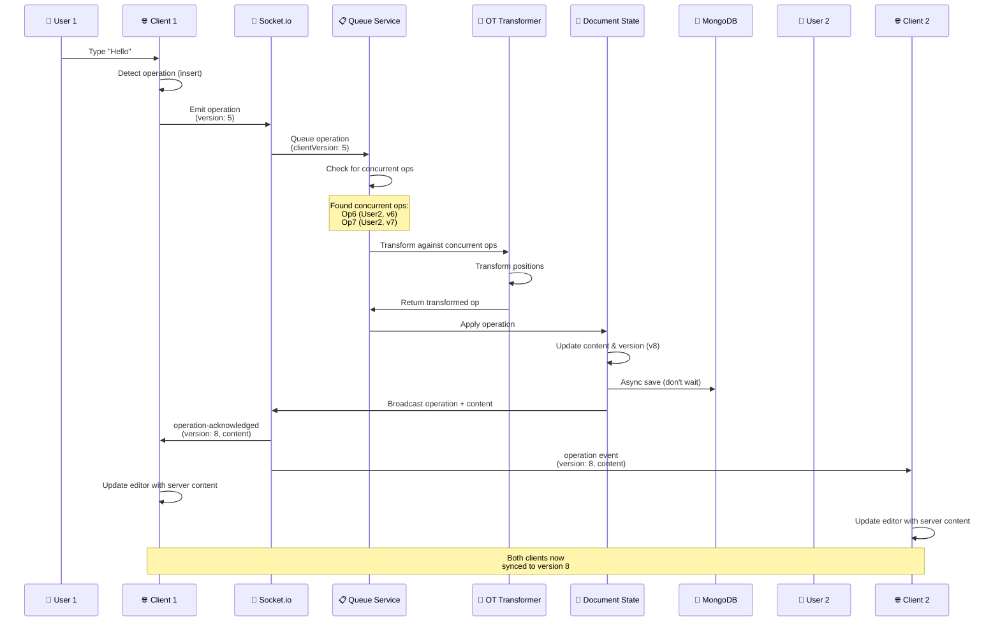
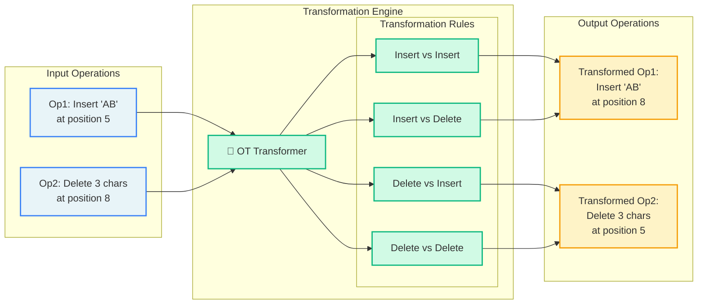
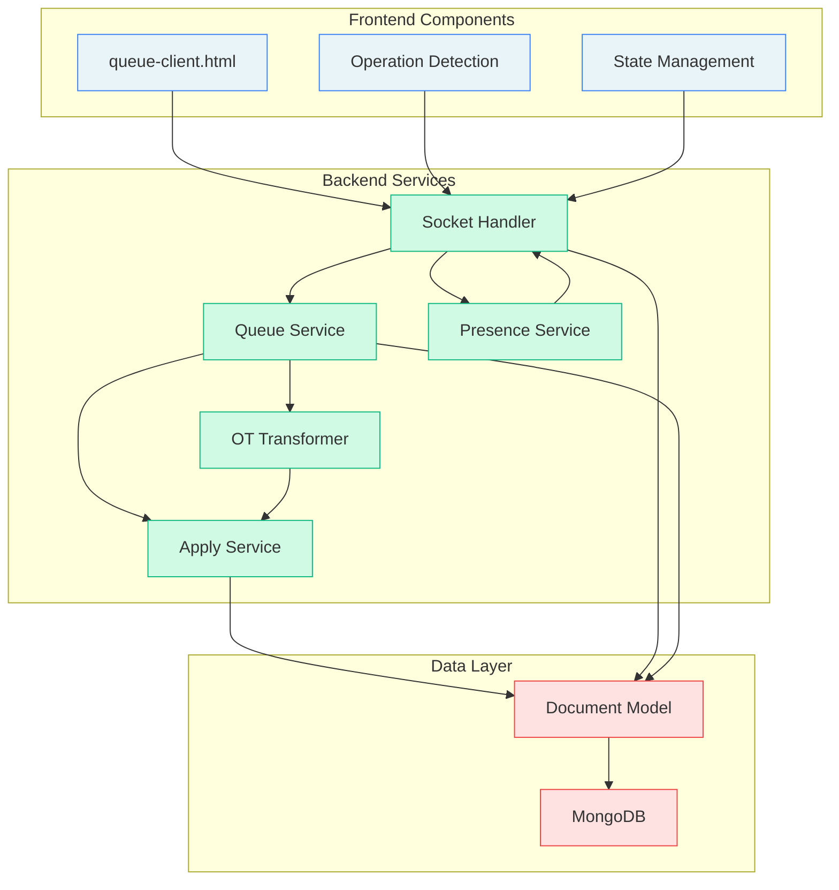
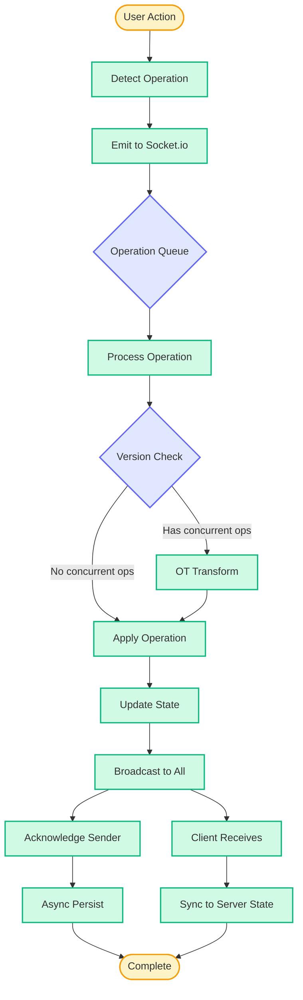
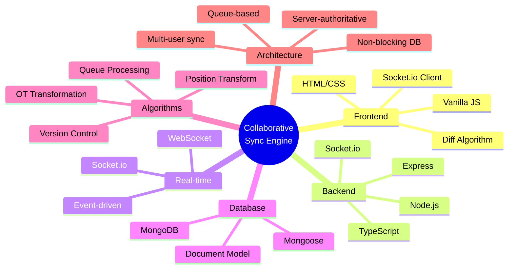

# 🏗️ Architecture Diagram - Collaborative Sync Engine

## Complete System Architecture

## Operation Flow Detail

## OT Transformation Logic

## Component Interaction Map

## Data Flow Architecture

## Technology Stack

## Key Architecture Principles

1. **Queue-Based Processing**: Operations are serialized through a queue system
2. **Server-Authoritative**: Server maintains the true state and broadcasts to clients
3. **Non-Blocking I/O**: Database writes don't block operation processing
4. **Version Control**: Client versions track operation concurrency
5. **Position Transformation**: OT transforms positions based on concurrent operations
6. **Event-Driven**: Socket.io enables real-time bidirectional communication

---

**Architecture designed for:**
- ⚡ **Performance** - Non-blocking operations, queue processing
- 🔄 **Consistency** - Server-authoritative state management  
- 👥 **Collaboration** - Multi-user real-time editing
- 🛡️ **Reliability** - Proper OT conflict resolution